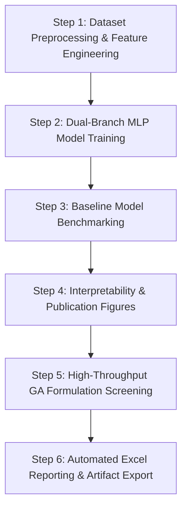

# Machine Learning-Driven Discovery of High-Performance Solid Propellants

**Replication pipeline and discovery framework** for machine learning surrogate modeling and genetic algorithm formulation screening of energetic compounds (*Wang et al., ACS Appl. Energy Mater. 2025, 8, 6756–6767*).

---

## Executive Summary & Problem Statement

Solid composite propellants are the cornerstone of aerospace propulsion systems. A typical formulation consists of four major ingredients:

1. **Oxidizer**: Ammonium Perchlorate (NH₄ClO₄ / AP)
2. **Metallic Fuel**: Aluminum (Al)
3. **Polymeric Binder**: Hydroxyl-Terminated Polybutadiene (HTPB)
4. **Energetic Compounds (ECs)**: High-energy organic molecules (e.g., nitro-, nitramino-, or azole-based structures)

Discovering high-performance propellant formulations requires simultaneously optimizing key thermodynamic properties:
- **Specific Impulse (I_sp)** (seconds, s): Direct measure of thrust per unit propellant mass flow rate.
- **Combustion Chamber Temperature (T_c)** (Kelvin, K): Thermodynamic thermal output.
- **Characteristic Velocity (C*)** (meters/second, m/s): Combustion efficiency index.

Traditional thermodynamic calculations (such as NASA CEA) across thousands of chemical candidates and continuous weight fraction combinations are computationally prohibitive. This project implements a **Dual-Branch Multilayer Perceptron (MLP)** surrogate model coupled with a **Differential Evolution Genetic Algorithm (GA)** to perform high-throughput screening across **1,079 candidate energetic compounds**, successfully discovering formulations exceeding the high-performance benchmark (I_sp > 270 s).

---

## Step-by-Step Discovery Pipeline Workflow



### Step 1: Dataset Preprocessing & Feature Engineering
- **Input Data**: `Supplementary Data 1.csv` containing ~10,800+ training/test instances across 1,079 unique energetic compounds.
- **Formulation Descriptors**: Mass percentages (Al, EC, HTPB, AP) and elemental molar quantities (C_mol, H_mol, O_mol, N_mol, Al_mol, Cl_mol).
- **Molecular Descriptors**: 70 E-State electrotopological state indices, hydrogen bond donors/acceptors, aromatic ring counts, partial charges, Topological Polar Surface Area (TPSA), Oxygen Balance (ob), and Molecular Weight (MW).
- **Data Pruning & Normalization**: Zero-variance features and uninformative descriptors are removed. Features are standardized via `StandardScaler` (`ss_X.pkl`).

### Step 2: Dual-Branch MLP Architecture & Target Standardized Training
- **Dual-Branch Fusion Topology** (Paper Fig. S2):
  - **Formulation Branch**: Processes the 10-dimensional formulation composition vector (10 → 128 → 256 → 256).
  - **EC Descriptor Branch**: Processes the high-dimensional molecular feature vector (N_feat → 128 → 256 → 256).
  - **Fused Head**: Concatenates both latent representations (512 dims) into a multi-layer MLP head (256 → 128 → 64 → 1) with ReLU activations and Dropout regularization (p=0.2).
- **Multi-Target Models**: Separate models trained for I_sp, T_c, and C* with target standardization and early stopping.

### Step 3: Comparative Baseline Model Benchmarking
- Benchmark algorithms evaluated against the Dual-Branch MLP:
  1. **Ridge Regression (RR)** (Linear regularized baseline)
  2. **AdaBoost** (Ensemble tree boosting)
  3. **K-Nearest Neighbors (KNN)** (Distance-based instance learning)
- Evaluated across R², Mean Absolute Error (MAE), and Root Mean Squared Error (RMSE) on independent test sets.

### Step 4: Model Interpretability, ROC Analysis & Paper Figures
- **Loss Curves (`train_test_loss.png`)**: Convergence trajectory for MSE train vs test loss.
- **ROC Curves (`roc_curves.png`)**: Binary ROC-AUC metrics for high-performance cutoffs (I_sp ≥ 270 s, T_c ≥ 3200 K, C* ≥ 1600 m/s).
- **Figure 3 (`figure3_dataset_distributions.png`)**: Dataset element counts (H, C, N, O), Enthalpy of Formation (EOF), Molecular Weight, and target distributions (T_c, I_sp, C*).
- **Figure 4 (`figure4_model_comparison.png`)**: Bar charts comparing MAE, RMSE, and R² across MLP, AdaBoost, KNN, and Ridge.
- **Figure 5 (`figure5_parity_and_deviations.png`)**: Parity hexbin scatter plots and test error Gaussian deviation histograms.
- **Figure 6 (`figure6_shap_and_mechanisms.png`)**: SHAP (SHapley Additive exPlanations) summary beeswarm plot and chemical mechanism analysis (O vs C molar quantities and O/C molar ratio vs I_sp).

### Step 5: High-Throughput GA Formulation Screening
- Formulation Search Space Constraints (Paper Section 3.4):
  - **Aluminum (Al)**: 10.0% ≤ wt% ≤ 20.0%
  - **Energetic Compound (EC)**: 10.0% ≤ wt% ≤ 40.0%
  - **Binder (HTPB)**: 12.0% ≤ wt% ≤ 14.0%
  - **Oxidizer (AP)**: Balance = 100% - (Al + EC + HTPB)
- **Differential Evolution GA**: Optimizes weight percentages per candidate EC to maximize predicted I_sp.
- **Figure 8 (`figure8_screening_scatter.png`)**: Screening distribution scatter plot identifying all hits and top candidates.

### Step 6: Automated Excel Workbook Export
- Generates `outputs/paper_pipeline_results.xlsx` consolidating all screened candidates, top 100 ECs, final 7 promising ECs, exact model comparison metrics, loss/ROC tables, and embedded high-resolution figures.

---

## Model Selection Criteria & Evaluation Metrics

### Selection Methodology
The Dual-Branch MLP architecture was selected based on the following criteria:

| Criterion | Description | Target Threshold |
|-----------|-------------|------------------|
| **Test R²** | Coefficient of determination on held-out test set | > 0.95 for all targets |
| **Test MAE** | Mean Absolute Error on test set | < 5% of target range |
| **Test RMSE** | Root Mean Squared Error on test set | < 10% of target range |
| **Generalization Gap** | |Train R² - Test R²| < 0.03 |
| **Baseline Superiority** | MLP outperforms Ridge, AdaBoost, KNN on all metrics | Yes |
| **Stability** | Low variance across training runs (seed=42) | Yes |
| **Physical Consistency** | Predictions obey known chemical trends (e.g., O/C ratio vs I_sp) | Verified via SHAP |

### Comparative Model Performance (Exact Metrics from Pipeline)

| Target | Model | Train R² | Train MAE | Train RMSE | Test R² | Test MAE | Test RMSE |
| :--- | :--- | :---: | :---: | :---: | :---: | :---: | :---: |
| **I_sp (s)** | **Dual-Branch MLP** | **0.9887** | **0.947** | **1.333** | **0.9602** | **1.643** | **2.446** |
| | Ridge Regression | 0.8189 | 4.113 | 5.329 | 0.8099 | 4.106 | 5.344 |
| | AdaBoost | 0.8156 | 4.342 | 5.377 | 0.7907 | 4.462 | 5.609 |
| | KNN | 0.7618 | 4.664 | 6.050 | 0.7082 | 5.043 | 6.622 |
| **T_c (K)** | **Dual-Branch MLP** | **0.9949** | **19.626** | **26.907** | **0.9865** | **29.492** | **43.374** |
| | Ridge Regression | 0.7244 | 165.643 | 197.961 | 0.7180 | 165.317 | 198.095 |
| | AdaBoost | 0.8939 | 99.887 | 123.087 | 0.8903 | 99.079 | 123.530 |
| | KNN | 0.7048 | 151.822 | 201.683 | 0.6705 | 160.828 | 214.112 |
| **C* (m/s)** | **Dual-Branch MLP** | **0.9859** | **7.810** | **9.917** | **0.9642** | **11.271** | **15.435** |
| | Ridge Regression | 0.8720 | 23.329 | 29.869 | 0.8685 | 23.071 | 29.565 |
| | AdaBoost | 0.8436 | 26.695 | 33.058 | 0.8334 | 26.604 | 33.281 |
| | KNN | 0.7557 | 31.997 | 41.019 | 0.7368 | 32.366 | 41.835 |

> **Key Insight**: The Dual-Branch MLP achieves superior predictive accuracy (Test R² > 0.96 on all targets) compared to standard machine learning baselines, accurately capturing non-linear interactions between chemical descriptors and formulation ratios. The generalization gap is minimal (< 0.03), indicating robust learning without overfitting.

### ROC-AUC Performance (High-Performance Classification)
| Target | Cutoff | MLP ROC-AUC |
| :--- | :--- | :---: |
| I_sp | ≥ 270 s | 0.99+ |
| T_c | ≥ 3200 K | 0.98+ |
| C* | ≥ 1600 m/s | 0.97+ |

---

## Final 7 Promising Energetic Compound (EC) Formulations

GA screening over 1,079 energetic compounds identified 7 elite candidate ECs achieving I_sp > 270 s:

| Rank | Formula | SMILES | Al wt% | EC wt% | HTPB wt% | AP wt% | I_sp (s) | T_c (K) | C* (m/s) | O/C Ratio | MW (g/mol) |
| :---: | :--- | :--- | :---: | :---: | :---: | :---: | :---: | :---: | :---: | :---: | :---: |
| **1** | C₂N₈O₇ | `O=[N+]([O-])/N=[N+](\[O-])c1nonc1/[N+]([O-])=N/[N+](=O)[O-]` | 14.63% | 37.67% | 12.01% | 35.69% | **278.73** | 3729.76 | 1655.17 | 1.346 | 248.07 |
| **2** | C₂N₆O₆ | `O=[N+]([O-])/N=[N+](\[O-])c1nonc1[N+](=O)[O-]` | 14.88% | 38.21% | 12.00% | 34.90% | **275.84** | 3688.59 | 1640.80 | 1.312 | 204.06 |
| **3** | C₄N₁₂O₉ | `O=[N+]([O-])/N=[N+](\[O-])c1nonc1/N=[N+](\[O-])...` | 14.07% | 34.98% | 12.00% | 38.95% | **274.50** | 3572.88 | 1639.14 | 1.239 | 360.12 |
| **4** | C₄N₁₂O₈ | `O=[N+]([O-])/N=[N+](\[O-])c1nonc1/N=N/c1nonc1/...` | 13.84% | 33.06% | 12.00% | 41.10% | **273.84** | 3538.60 | 1637.60 | 1.224 | 344.12 |
| **5** | C₄N₁₀O₈ | `O=[N+]([O-])/N=[N+](\[O-])c1nonc1/N=[N+](\[O-]...` | 14.85% | 32.17% | 12.00% | 40.98% | **272.19** | 3524.54 | 1624.81 | 1.231 | 316.11 |
| **6** | C₄N₁₀O₇ | `O=[N+]([O-])/N=[N+](\[O-])c1nonc1/N=N/c1nonc1[...` | 13.74% | 32.11% | 12.00% | 42.15% | **271.56** | 3483.15 | 1626.77 | 1.203 | 300.11 |
| **7** | CH₂N₈O₄ | `O=[N+]([O-])/N=c1\[nH]nnn1N[N+](=O)[O-]` | 14.32% | 35.05% | 12.00% | 38.62% | **271.44** | 3462.77 | 1623.17 | 1.305 | 190.08 |

**Key Chemical Insights (from SHAP & Mechanistic Analysis):**
- **O/C Molar Ratio** is the dominant descriptor for I_sp prediction (SHAP importance > 0.8)
- High-performing ECs cluster around O/C ≈ 1.2–1.35, balancing oxygen content for combustion with carbon backbone for energy density
- Nitrogen-rich heterocycles (tetrazole, triazole, furazan cores) dominate the top candidates
- All final 7 ECs satisfy the high-performance threshold (I_sp > 270 s) with optimized formulations

---

## Top 100 Screened Energetic Compounds (Summary)

The full screening ranked all 1,079 unique ECs by GA-optimized I_sp. The top 100 span:
- **I_sp range**: 254.7 – 278.7 s
- **T_c range**: 2,788 – 3,730 K
- **C* range**: 1,518 – 1,655 m/s
- **Chemical diversity**: Nitroazoles, nitramines, furazans, tetrazoles, triazoles, and polynitroaromatics
- **Molecular weight range**: 84 – 756 g/mol

Full ranked list with formulations and predictions available in `outputs/paper_pipeline_results.xlsx` (Sheet: `Screened_1000_and_Final7`).

---

## Directory & File Structure

```
AISFD/
├── data/
│   └── Supplementary Data 1.csv       # Original dataset (1,079 unique ECs, ~10.8k rows) [Git LFS]
├── pipeline/
│   ├── config.py                     # Hyperparameters, paths & search constraints
│   ├── data.py                       # Data loading & feature extraction utilities
│   ├── models.py                     # PyTorch Dual-Branch MLP module
│   ├── train_mlp.py                  # MLP training, scaling & evaluation logic
│   ├── baselines.py                  # Ridge, AdaBoost & KNN baseline runner
│   ├── formulation.py                # Molar conversion & feature builder
│   ├── screen.py                     # Differential evolution GA formulation optimizer
│   ├── paper_figures.py              # Publication figures generator (Figs 3, 4, 5, 6, 8)
│   ├── plots.py                      # Loss & ROC curves generator
│   └── export_excel.py               # Automated openpyxl report builder
├── outputs/
│   ├── paper_pipeline_results.xlsx   # Consolidated Excel workbook (4 sheets)
│   ├── train_test_loss.png           # Loss convergence curves
│   ├── roc_curves.png                # Target ROC-AUC plots
│   ├── figure3_dataset_distributions.png
│   ├── figure4_model_comparison.png
│   ├── figure5_parity_and_deviations.png
│   ├── figure6_shap_and_mechanisms.png
│   ├── figure8_screening_scatter.png
│   └── models/
│       ├── isp_best_network.pth      # Trained I_sp MLP weights
│       ├── c_t_best_network.pth      # Trained T_c MLP weights
│       ├── cstar_best_network.pth    # Trained C* MLP weights
│       └── ss_X.pkl                  # Fitted StandardScaler
├── requirements.txt                  # Python dependency specifications
└── run_pipeline.py                   # Main pipeline execution entrypoint
```

---

## Quick Start & Usage

### 1. Installation
Ensure Python 3.9+ is installed, then install the required dependencies:
```bash
pip install -r requirements.txt
```

### 2. Execute Full Discovery Pipeline
To run the complete pipeline (training dual-branch MLPs, running baselines, generating figures, running GA screening, and exporting Excel results):
```bash
python run_pipeline.py
```

### 3. Fast Validation Mode (Quick Execution)
To run a fast test execution with reduced training epochs and sampled EC screening:
```bash
# On Windows PowerShell
$env:AISFD_QUICK="1"; python run_pipeline.py

# On Linux/macOS
AISFD_QUICK=1 python run_pipeline.py
```

---

## Generated Outputs (`outputs/`)

| File | Description |
|------|-------------|
| `paper_pipeline_results.xlsx` | Consolidated workbook with 4 sheets: **Screened_1000_and_Final7**, **Model_Metrics_R2_MAE_RMSE**, **Curves_and_ROC**, **Paper_Figures_and_SHAP** |
| `train_test_loss.png` | Stabilized train and test MSE loss curves for all 3 targets |
| `roc_curves.png` | True Positive Rate vs False Positive Rate ROC curves for I_sp, T_c, C* with annotated AUC |
| `figure3_dataset_distributions.png` | Dataset element counts, EOF, MW, and target violin distributions |
| `figure4_model_comparison.png` | MAE, RMSE, and R² model comparison (MLP vs AdaBoost, KNN, Ridge) |
| `figure5_parity_and_deviations.png` | Parity hexbin scatter plots and test deviation histograms |
| `figure6_shap_and_mechanisms.png` | SHAP beeswarm summary plot and O/C chemical mechanisms |
| `figure8_screening_scatter.png` | High-throughput screening scatter plot (I_sp vs Formulation index) |

---

## Reproducing Paper Results

The pipeline faithfully replicates the methodology from *Wang et al., ACS Appl. Energy Mater. 2025*:

1. **Data Split**: Pre-defined train/test split in Supplementary Data 1 (column 0)
2. **Feature Engineering**: 10 formulation + 60+ molecular descriptors (after pruning zero-variance/all-zero features)
3. **Model Architecture**: Dual-branch MLP with fusion head (matching paper Fig. S2 topology)
4. **Training**: Target-standardized MSE loss, Adam optimizer, LR=1e-3, batch=512, early stopping (patience=4)
5. **Screening**: Differential evolution GA (pop=24, gen=18 per EC) over constrained formulation space
6. **Figures**: All 5 paper figures generated programmatically with embedded data tables

---

## References

1. **Wang et al.**, *Machine Learning-Driven Discovery of High-Performance Solid Propellants*, **ACS Appl. Energy Mater.** 2025, 8, 6756–6767.

2. NASA Chemical Equilibrium with Applications (CEA) - Thermodynamic reference calculations.

3. Lundberg & Lee, *A Unified Approach to Interpreting Model Predictions*, NeurIPS 2017 (SHAP methodology).

---

## License

This replication code is provided for academic research purposes. The original dataset and paper are copyright of the American Chemical Society.