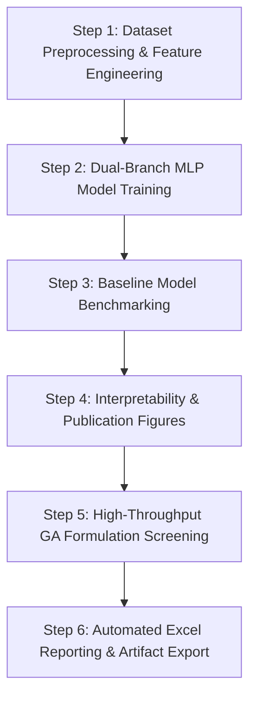

# Machine Learning-Driven Discovery of High-Performance Solid Propellants

Replication pipeline and discovery framework for machine learning surrogate modeling and genetic algorithm formulation screening of energetic compounds (*Wang et al., ACS Appl. Energy Mater. 2025, 8, 6756–6767*).

---

## Executive Summary & Problem Statement

Solid composite propellants are the cornerstone of aerospace propulsion systems. A typical formulation consists of four major ingredients:
1. **Oxidizer**: Ammonium Perchlorate ($\text{NH}_4\text{ClO}_4$ / AP)
2. **Metallic Fuel**: Aluminum ($\text{Al}$)
3. **Polymeric Binder**: Hydroxyl-Terminated Polybutadiene (HTPB)
4. **Energetic Compounds (ECs)**: High-energy organic molecules (e.g., nitro-, nitramino-, or azole-based structures)

Discovering high-performance propellant formulations requires simultaneously optimizing key thermodynamic properties:
- **Specific Impulse ($I_{sp}$)** (seconds, $s$): Direct measure of thrust per unit propellant mass flow rate.
- **Combustion Chamber Temperature ($T_c$)** (Kelvin, $K$): Thermodynamic thermal output.
- **Characteristic Velocity ($C^*$)** (meters/second, $m/s$): Combustion efficiency index.

Traditional thermodynamic calculations (such as NASA CEA) across thousands of chemical candidates and continuous weight fraction combinations are computationally prohibitive. This project implements a **Dual-Branch Multilayer Perceptron (MLP)** surrogate model coupled with a **Differential Evolution Genetic Algorithm (GA)** to perform high-throughput screening across **1,079 candidate energetic compounds**, successfully discovering formulations exceeding the high-performance benchmark ($I_{sp} > 270\text{ s}$).

---

## Step-by-Step Discovery Pipeline Workflow



### Step 1: Dataset Preprocessing & Feature Engineering
- **Input Data**: `Supplementary Data 1.csv` containing ~10,800+ training/test instances across 1,079 unique energetic compounds.
- **Formulation Descriptors**: Mass percentages ($\text{Al}$, $\text{EC}$, $\text{HTPB}$, $\text{AP}$) and elemental molar quantities ($C_{mol}$, $H_{mol}$, $O_{mol}$, $N_{mol}$, $Al_{mol}$, $Cl_{mol}$).
- **Molecular Descriptors**: 70 E-State electrotopological state indices, hydrogen bond donors/acceptors, aromatic ring counts, partial charges, Topological Polar Surface Area (TPSA), Oxygen Balance ($ob$), and Molecular Weight ($MW$).
- **Data Pruning & Normalization**: Zero-variance features and uninformative descriptors are removed. Features are standardized via `StandardScaler` (`ss_X.pkl`).

### Step 2: Dual-Branch MLP Architecture & Target Standardized Training
- **Dual-Branch Fusion Topology** (Paper Fig. S2):
  - **Formulation Branch**: Processes the 10-dimensional formulation composition vector ($10 \to 128 \to 256 \to 256$).
  - **EC Descriptor Branch**: Processes the high-dimensional molecular feature vector ($N_{feat} \to 128 \to 256 \to 256$).
  - **Fused Head**: Concatenates both latent representations ($512 \text{ dims}$) into a multi-layer MLP head ($256 \to 128 \to 64 \to 1$) with $\text{ReLU}$ activations and Dropout regularization ($p=0.2$).
- **Multi-Target Models**: Separate models trained for $I_{sp}$, $T_c$, and $C^*$ with target standardization and early stopping.

### Step 3: Comparative Baseline Model Benchmarking
- Benchmark algorithms evaluated against the Dual-Branch MLP:
  1. **Ridge Regression (RR)** (Linear regularized baseline)
  2. **AdaBoost** (Ensemble tree boosting)
  3. **K-Nearest Neighbors (KNN)** (Distance-based instance learning)
- Evaluated across $R^2$, Mean Absolute Error (MAE), and Root Mean Squared Error (RMSE) on independent test sets.

### Step 4: Model Interpretability, ROC Analysis & Paper Figures
- **Loss Curves (`train_test_loss.png`)**: Convergence trajectory for MSE train vs test loss.
- **ROC Curves (`roc_curves.png`)**: Binary ROC-AUC metrics for high-performance cutoffs ($I_{sp} \ge 270\text{ s}$, $T_c \ge 3200\text{ K}$, $C^* \ge 1600\text{ m/s}$).
- **Figure 3 (`figure3_dataset_distributions.png`)**: Dataset element counts ($\text{H, C, N, O}$), Enthalpy of Formation (EOF), Molecular Weight, and target distributions ($T_c, I_{sp}, C^*$).
- **Figure 4 (`figure4_model_comparison.png`)**: Bar charts comparing MAE, RMSE, and $R^2$ across MLP, AdaBoost, KNN, and Ridge.
- **Figure 5 (`figure5_parity_and_deviations.png`)**: Parity hexbin scatter plots and test error Gaussian deviation histograms.
- **Figure 6 (`figure6_shap_and_mechanisms.png`)**: SHAP (SHapley Additive exPlanations) summary beeswarm plot and chemical mechanism analysis ($O$ vs $C$ molar quantities and $O/C$ molar ratio vs $I_{sp}$).

### Step 5: High-Throughput GA Formulation Screening
- Formulation Search Space Constraints (Paper Section 3.4):
  - **Aluminum ($\text{Al}$)**: $10.0\% \le \text{wt}\% \le 20.0\%$
  - **Energetic Compound ($\text{EC}$)**: $10.0\% \le \text{wt}\% \le 40.0\%$
  - **Binder ($\text{HTPB}$)**: $12.0\% \le \text{wt}\% \le 14.0\%$
  - **Oxidizer ($\text{AP}$)**: Balance $= 100\% - (\text{Al} + \text{EC} + \text{HTPB})$
- **Differential Evolution GA**: Optimizes weight percentages per candidate EC to maximize predicted $I_{sp}$.
- **Figure 8 (`figure8_screening_scatter.png`)**: Screening distribution scatter plot identifying all hits and top candidates.

### Step 6: Automated Excel Workbook Export
- Generates `outputs/paper_pipeline_results.xlsx` consolidating all screened candidates, top 100 ECs, final 7 promising ECs, exact model comparison metrics, loss/ROC tables, and embedded high-resolution figures.

---

## Empirical Model Performance Metrics

Below are the quantitative model performance metrics ($R^2$, MAE, RMSE) across the training and testing datasets:

| Target | Model | Train $R^2$ | Train MAE | Train RMSE | Test $R^2$ | Test MAE | Test RMSE |
| :--- | :--- | :---: | :---: | :---: | :---: | :---: | :---: |
| **$I_{sp}$ (s)** | **Dual-Branch MLP** | **0.989** | **0.947** | **1.333** | **0.960** | **1.643** | **2.446** |
| | Ridge Regression | 0.819 | 4.113 | 5.329 | 0.810 | 4.106 | 5.344 |
| | AdaBoost | 0.816 | 4.342 | 5.377 | 0.791 | 4.462 | 5.609 |
| | KNN | 0.762 | 4.664 | 6.050 | 0.708 | 5.043 | 6.622 |
| **$T_c$ (K)** | **Dual-Branch MLP** | **0.995** | **19.626** | **26.907** | **0.986** | **29.492** | **43.374** |
| | Ridge Regression | 0.724 | 165.643 | 197.961 | 0.718 | 165.317 | 198.095 |
| | AdaBoost | 0.894 | 99.887 | 123.087 | 0.890 | 99.079 | 123.530 |
| | KNN | 0.705 | 151.822 | 201.683 | 0.671 | 160.828 | 214.112 |
| **$C^*$ (m/s)** | **Dual-Branch MLP** | **0.986** | **7.810** | **9.917** | **0.964** | **11.271** | **15.435** |
| | Ridge Regression | 0.872 | 23.329 | 29.869 | 0.869 | 23.071 | 29.565 |
| | AdaBoost | 0.844 | 26.695 | 33.058 | 0.833 | 26.604 | 33.281 |
| | KNN | 0.756 | 31.997 | 41.019 | 0.737 | 32.366 | 41.835 |

> **Key Insight**: The Dual-Branch MLP achieves superior predictive accuracy ($R^2 > 0.96$ on all test sets) compared to standard machine learning baselines, accurately capturing non-linear interactions between chemical descriptors and formulation ratios.

---

## Final 7 Promising Energetic Compound (EC) Formulations

GA screening over 1,079 energetic compounds identified 7 elite candidate ECs achieving $I_{sp} > 270\text{ s}$:

| Rank | Formula | SMILES | Al wt% | EC wt% | HTPB wt% | AP wt% | $I_{sp}$ (s) | $T_c$ (K) | $C^*$ (m/s) | O/C Ratio | MW (g/mol) |
| :---: | :--- | :--- | :---: | :---: | :---: | :---: | :---: | :---: | :---: | :---: | :---: |
| **1** | $\text{C}_2\text{N}_8\text{O}_7$ | `O=[N+]([O-])/N=[N+](\[O-])c1nonc1/[N+]([O-])=N...` | 14.63% | 37.67% | 12.01% | 35.69% | **278.73** | 3729.76 | 1655.17 | 1.346 | 248.07 |
| **2** | $\text{C}_2\text{N}_6\text{O}_6$ | `O=[N+]([O-])/N=[N+](\[O-])c1nonc1[N+](=O)[O-]` | 14.88% | 38.21% | 12.00% | 34.90% | **275.84** | 3688.59 | 1640.80 | 1.312 | 204.06 |
| **3** | $\text{C}_4\text{N}_{12}\text{O}_9$ | `O=[N+]([O-])/N=[N+](\[O-])c1nonc1/N=[N+](\[O-]...` | 14.07% | 34.98% | 12.00% | 38.95% | **274.50** | 3572.88 | 1639.14 | 1.239 | 360.12 |
| **4** | $\text{C}_4\text{N}_{12}\text{O}_8$ | `O=[N+]([O-])/N=[N+](\[O-])c1nonc1/N=N/c1nonc1/...` | 13.84% | 33.06% | 12.00% | 41.10% | **273.84** | 3538.60 | 1637.60 | 1.224 | 344.12 |
| **5** | $\text{C}_4\text{N}_{10}\text{O}_8$ | `O=[N+]([O-])/N=[N+](\[O-])c1nonc1/N=[N+](\[O-]...` | 14.85% | 32.17% | 12.00% | 40.98% | **272.19** | 3524.54 | 1624.81 | 1.231 | 316.11 |
| **6** | $\text{C}_4\text{N}_{10}\text{O}_7$ | `O=[N+]([O-])/N=[N+](\[O-])c1nonc1/N=N/c1nonc1[...` | 13.74% | 32.11% | 12.00% | 42.15% | **271.56** | 3483.15 | 1626.77 | 1.203 | 300.11 |
| **7** | $\text{CH}_2\text{N}_8\text{O}_4$ | `O=[N+]([O-])/N=c1\[nH]nnn1N[N+](=O)[O-]` | 14.32% | 35.05% | 12.00% | 38.62% | **271.44** | 3462.77 | 1623.17 | 1.305 | 190.08 |

---

## Directory & File Structure

```
AISFD/
├── data/
│   └── Supplementary Data 1.csv       # Original dataset (1,079 unique ECs, ~10.8k rows)
├── pipeline/
│   ├── config.py                     # Hyperparameters, paths & search constraints
│   ├── data.py                       # Data loading & feature extraction utilities
│   ├── models.py                     # PyTorch Dual-Branch MLP module
│   ├── train_mlp.py                  # MLP training, scaling & evaluation logic
│   ├── baselines.py                  # Ridge, AdaBoost & KNN baseline runner
│   ├── formulation.py                # Molar conversion & feature builder
│   ├── screen.py                     # Differential evolution GA formulation optimizer
│   ├── paper_figures.py              # Publication figures generator (Figs 3, 4, 5, 6, 8)
│   ├── plots.py                      # Loss & ROC curves generator
│   └── export_excel.py               # Automated openpyxl report builder
├── outputs/
│   ├── paper_pipeline_results.xlsx   # Consolidated Excel workbook
│   ├── train_test_loss.png           # Loss convergence curves
│   ├── roc_curves.png                # Target ROC-AUC plots
│   ├── figure3_dataset_distributions.png
│   ├── figure4_model_comparison.png
│   ├── figure5_parity_and_deviations.png
│   ├── figure6_shap_and_mechanisms.png
│   └── figure8_screening_scatter.png
├── requirements.txt                  # Python dependency specifications
└── run_pipeline.py                   # Main pipeline execution entrypoint
```

---

## Quick Start & Usage

### 1. Installation
Ensure Python 3.9+ is installed, then install the required dependencies:
```bash
pip install -r requirements.txt
```

### 2. Execute Full Discovery Pipeline
To run the complete pipeline (training dual-branch MLPs, running baselines, generating figures, running GA screening, and exporting Excel results):
```bash
python run_pipeline.py
```

### 3. Fast Validation Mode (Quick Execution)
To run a fast test execution with reduced training epochs and sampled EC screening:
```bash
# On Windows PowerShell
$env:AISFD_QUICK="1"; python run_pipeline.py

# On Linux/macOS
AISFD_QUICK=1 python run_pipeline.py
```

---

## References

1. **Wang et al.**, *Machine Learning-Driven Discovery of High-Performance Solid Propellants*, **ACS Appl. Energy Mater.** 2025, 8, 6756–6767.
